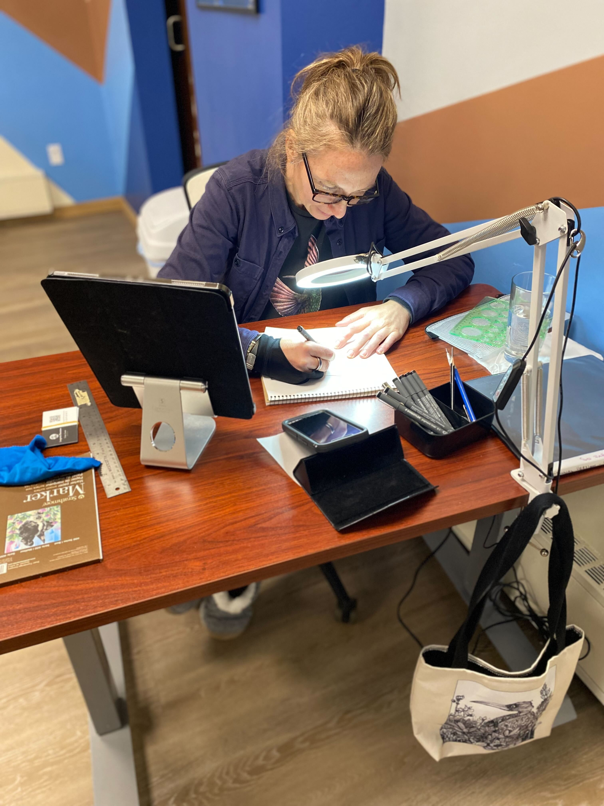
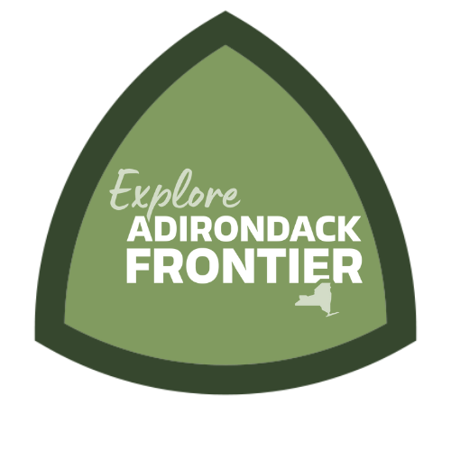

+++
title = "Inktober2023 Retreat"
description = "A retreat for artists tackling the Inktober illustration challenge"
template = "inktober.html"
[extra]
image = "inktober-adk.jpg"
+++
We are excited to be running our second year of artist retreats in partnership with Inktober!

Jump directly to…[dates](#when-where-and-how-much) or [tickets](#book-early-and-save-100).

{{ youtube(id="Zqxf0b07xYk" orientation="portrait") }}

## What is the Inktober Challenge?

Inktober is a drawing challenge where thousands of artists worldwide are given a single-word prompt then challenged to complete an illustration each and every day during the entire month of October. It's a chance to be consistently creative, improve artistic skills, practice discipline, while participating in a huge online community event.

> "It's been so amazing and I feel so happy because it's not just I got the goal done, but you were all supporting me. I've been doing Inktober since at least 2016 and I've never gotten 31 drawings done before." —Denise

## What to expect at the Inktober2023 Retreat

You hang out with other artists and spend each day working on the Inktober2023 illustration prompts. Your peers help keep you on track, and maybe even inspire you to get ahead of schedule. Last year one guest completed 25 illustrations in a single week! You eat delicious meals freshly prepared from local ingredients. You **don't** do any chores, cooking, or dishes. It's a time to give yourself a break. To rest. To re-energize.

The best way to understand what we are about, whether it's what you need, and what your daily experience here will be like is to check out these pages:

1. [Our Values](/values)
1. [The Retreat Recipe](/recipe)
1. [What to Expect](/what-to-expect)

> "I needed a rest or I needed something; I needed a reboot and I needed to meet people and I wanted to meet artists, especially people who like ink." —Chloe

## Who should attend the Inktober2023 Retreat?

All are welcome! Inktober's mission is to awaken the artist inside of every human being. Focus Retreat Center is the perfect environment for artists to focus on their deepest, most creative work surrounded by other artists and peers. The retreat is a personalized experience open to any artist looking to improve, connect with themselves, build community and have fun. Join us, we look forward to meeting you!

## Retreat to Flourish

There is no better catalyst for artistic output than being surrounded by other inspiring artists. You will learn. You will teach. You will be surprised and amazed.

> "I've learned so much about color, about work, about paying attention and not giving up, about doing better, about how much more there is to know from the two of you. I get to keep that the rest of my life." —George

> "I learned a lot from everybody. A little thing here, a little thing there. I'll never forget any of you guys or any of this experience. It's so frickin' cool. My soul thanks you." —Mike S

## Retreat to Reconnect

Being a creative person can be an isolating experience, especially if you are self-employed, work from home or still recovering from the social isolation of the pandemic lockdown. Attending the Inktober2023 Retreat is a chance to meet new people and spend time making friends over shared meals in a relaxed, scenic setting.

> "I just felt really at home and really welcomed and it was really cool." —Gina

> "I am so grateful to have met each and every one of you. I'm so happy that I took that leap of faith." —Megan

## Retreat to Nature

October in northern New York is peak leaf peepin' season and the foliage is gorgeous. FRC sits adjacent to Adirondack Park, the largest system of hiking trails in America. The park is larger than the state of New Hampshire and boasts thousands of lakes, rivers, and mountains. Guests self-organize hikes and excursions into the park throughout the week.

## Retreat to Grow

Jake Parker's original Inktober challenge in 2009 was something he imposed on himself specifically to improve his pen and ink skills, which were not his strength at the time. Take inspiration from Jake and put in the deliberate practice that will give you new and improved skills that will last forever.

> "You've also just taught me so much in terms of not just art technique but almost like life in general." —Audrey

## When, where and how much?

**Monday Oct 16, 2023** through **Sunday Oct 22, 2023**. This is immediately following NY Comic Con, so if you are traveling into the area for that, tack a retreat onto the end of your trip!

FRC is in Malone, NY and [all your travel options and details are covered on our travel page](/travel).

The cost is **$898** all inclusive for the event. This includes:

* Six nights lodging in a private bedroom
* All your meals, snacks, coffee and tea

### Extra Bonuses Included With Your Ticket

* 1 month **FREE** subscription to the [School of Visual Storytelling](svslearn.com)'s huge catalog of illustration courses with top instructors and professional artists plus a discount if you later upgrade to a membership.
* An exclusive masterclass video session with Jake Parker, creator of Inktober
* Gift bags with awesome supplies and goodies from Inktober2023 sponsors

**Payment in installments is available** so you can spread the cost out evenly over 6 affordable monthly payments.

<a style="display:inline-block;text-decoration:none;background-color:#0044B4;color:#ffffff;cursor:pointer;font-family:Helvetica,Arial,sans-serif;font-size:22px;line-height:50px;text-align:center;margin:0;height:50px;padding:0px 33px;border-radius:24px;max-width:100%;white-space:nowrap;overflow:hidden;text-overflow:ellipsis;font-weight:bold;-webkit-font-smoothing:antialiased;-moz-osx-font-smoothing:grayscale;" href="" onclick="window.enrollsy.openWidget({type:'ENROLL',slug:'focus-retreat-center',urlOptions:'%7B%22lId%22:%22cl6w7sr5i3h5m0706s5dv3ln9%22,%22pId%22:%22clfo48ybczqff0846v1l9dc4c%22%7D'});return false;">Book Now</a> 

{{ questions() }}

# Explore Adirondack Frontier

Inktober2023 at Focus Retreat Center is made possible in part by a grant from the Franklin County Government Office of Economic Development and Tourism. We encourage everyone to explore the many sites and destinations throughout Franklin County!

