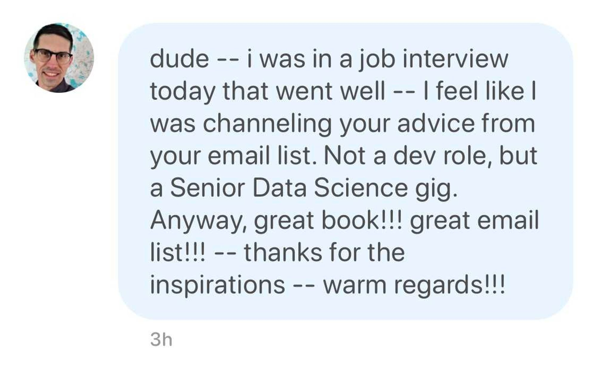

+++
title = "Senior Engineer Mindset with Swizec Teller"
description = "Focus on your career with a small group of peers"
[extra]
image = "workshop.jpg"
+++

From the folks behind the international Senior Engineer Mindset workshop and bestselling <a href="https://seniormindset.com" target="_blank">Senior Engineer Mindset book</a> comes the Senior Mindset Retreat &mdash; a week in nature to focus on your career with a small group of peers.

## A week in nature to focus on your career

**Picture this:**

You’re in a renovated historic mansion. The sun is shining, birds are singing. Nearby there’s a lake.

You walk down to the kitchen where a delicious home-cooked breakfast awaits. Everyone sitting around the table chatting. Relaxed. You’re engineers with plenty to talk about. The energy is palpable. Good vibes.

After breakfast you sit on the couch for a workshop focused on career growth and the mindset of a senior engineer. No laptops, just friendly conversation and thought-provoking ideas.

In the afternoon, you have time to process. Relax with your thoughts. Maybe go hiking, canoeing on the lake, or just enjoy the summer weather in upstate New York.

For dinner, more delicious food and deep conversation before you relax into bed in your private room.

Sounds nice eh? I would ****love**** that. My best ideas for career growth always come from a week of zero obligation and lots of unstructured time.

And that’s what the **Senior Mindset Retreat** is all about.

{{ applyswiz() }}

## What is the Senior Mindset Retreat

A week of gently structured time and workshops to focus on your career with plenty of thinking time to process. You can turn that into a huge raise, new opportunity, or just loving your job *today*.

The plan looks like this:

- 7 days
- historic mansion
- late summer
- upstate New York
- Senior Mindset workshop
- Resume polishing workshop
- 1-on-1 time with Swiz
- hardcover copy of Senior Engineer Mindset
- guest talk from Josh Doody, a salary negotiation coach
- full access to Josh Doody’s <a target="_blank" href="https://fearlesssalarynegotiation.com/salary-negotiation-mastery/">Salary Negotiation Mastery</a> course
- 2 followup calls with Swiz at 3 and 6 weeks out
- a lifetime of memories
- carefully curated group of folks

We are expecting up to 13 folks and want to ensure a welcoming atmosphere with matching goals and priorities. Everyone will be held to a code-of-conduct and in similar stages of their career.

Some folks have said that just the application form has been a valuable exercise ❤️

{{ applyswiz() }}

## Why join the Senior Mindset Retreat

This is where you’d expect to read a bunch of testimonials espousing the virtues of the Senior Mindset retreat, but it’s our first time doing the retreat format. Instead, here’s what people had to say after reading the book or joining an in-person workshop.

<blockquote class="twitter-tweet">
Just finished “Senior Engineer Mindset” book by <a href="https://twitter.com/Swizec?ref_src=twsrc%5Etfw">@Swizec</a>. Any developer wanting to grow in seniority would benefit from it. Simple. Actionable. No BS. Derived from the author’s wide reading and significant experience. <a href="https://t.co/5xdVy2UUnB">https://t.co/5xdVy2UUnB</a>
&mdash; Samuel Path (@smlpth) <a href="https://twitter.com/smlpth/status/1637536050305277952?ref_src=twsrc%5Etfw">March 19, 2023</a></blockquote> 

> i was excited for this workshop! It reinforced several points but the main point i learned was the path to seniority lies more in teamwork than technical skill. The comfortability and closeness allowed us all to participate, unlike what you may find in a conference presentation. It's great to align yourself with the views of peers and those with experience &mdash; Brandon

> I had no hesitation joining this workshop. It taught me to put more emphasis on selling yourself publicly. Swizec created a comfortable environment for discussions and shared relatable examples that reinforced some of my existing thoughts / practices. The workshop gives a good insight on how to think about development outside of the technical things. &mdash; Greg

> I thought that it was going to be very technical, and I am not yet a senior so I was nervous. But we learned about ownership and impact, how to be a leader, that technical skills matter less than I think and I enjoyed the open forum with great visual examples. The workshop gave me more confidence in my path toward a senior role. It encouraged me to utilize my personal strengths in a way to help the team, lead, and deliver value &mdash; Sydney

After the retreat you will:

- have new mental frameworks to apply in your career
- feel more confident and comfortable leading ambitious projects
- have bigger impact on your company
- get recognized and promoted faster
- stand out to recruiters and hiring managers
- work as a trusted peer with product and your manager
- have a new cluster of trusted friends and peers for your professional support network

## Dates & Pricing

The retreat will run: **Saturday August 12, 2023** through **Saturday August 19, 2023**.

Pricing includes

- lodging in a private room
- all inclusive home-cooked meals
- workshops
- lifetime access to digital content

Super early bird (3 tickets) – $4000

Early bird (3 tickets) – $4500

Regular (7 tickets) – $5000

We can help you get employer sponsorship from your professional development budget.

{{ applyswiz() }}

{{ questions() }}
