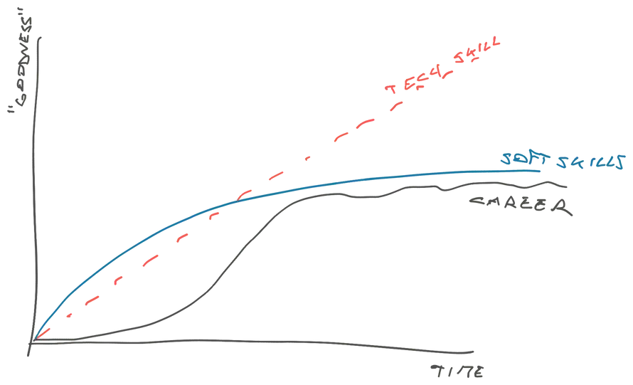

+++
title = "Senior Engineer Mindset with Swizec Teller"
description = "Focus on your career with a small group of peers"
[extra]
image = "workshop.jpg"
+++

From the folks behind the international Senior Engineer Mindset workshop and bestselling <a href="https://seniormindset.com" target="_blank">Senior Engineer Mindset book</a> comes the Senior Mindset Retreat &mdash; a week in nature to focus on your career with a small group of peers.

A strong career is about more than your hands-on tech skills. After the first few years tech becomes necessary, but not sufficient.

Here's what people care about when you go beyond mid-level engineer:

*   Do you ship?
*   Do you flag issues early?
*   Do you find ways to go fast without hurting quality?
*   Do you leave a mess?
*   Can you guide a team?
*   Does every team you're on "magically" become better?
*   How well do you work with others?
*   Do you have ideas?
*   Do you find and suggest improvements?
*   Do you dig until the problem is solved or do you give up?
*   Can you be trusted to make the right call?
*   Can you be trusted to realize when it's not your call to make?
*   Are you a good inputter or do you hold back?
*   Can we let you own a thing and trust you'll make it happen?
*   Does it feel like you want to be here?

_That_'s the job. We all know you can code and ... meh, lots of people can code. What's impressive is when you can deliver! The outcome, not the code. Code is easy.

## Soft skills limit your career

The graph drawn in Senior Mindset workshops to illustrate this concept looks something like this:

<figure>

<figcaption>Career goodness over time</figcaption>
</figure>

Your soft skills start way better than your tech skills. Unless you're like Swizec – a massive nerd who loves computers. In the beginning your career grows fast as you get better at everything.

But as your tech skills keep growing (because that's easy), your career starts bouncing off the glass ceiling of your soft skills. Like an engine off a rev limiter.

You keep pushing and pushing on your tech skills, but the engine just can't rev any faster. You need a better engine!

## The Senior Mindset Retreat helps you build a better engine

The Senior Mindset Retreat is structured around a multi-day version of the international Senior Mindset workshop.

The workshop has been a great success. Here's what an attendee had to say:

> i was excited for this workshop! It reinforced several points but the main point i learned was the path to seniority lies more in teamwork than technical skill. The comfortability and closeness allowed us all to participate, unlike what you may find in a conference presentation. It's great to align yourself with the views of peers and those with experience — Brandon

But attendees consistently give this feedback: _"Can we take more breaks? You packed a lot of insight into my brain, I need time to process"_.

And no wonder! The Senior Mindset packs 10+ years of insights and experiments into a short amount of time. The reading list shared after will keep you busy for months, if not years.

That's where the retreat comes in.

The Senior Mindset Retreat takes that jam-packed workshop and expands it into several days.

You get 5 modules:

*   Growing your career
*   The goal of engineering
*   Ownership
*   Teamwork
*   Theory of constraints

Spread over a few days with plenty of unstructured time to process. That processing is the secret sauce. Swiz says "My best life decisions come from packing my brain full of an idea, then going out into nature and away from screens to think."

In the evenings, we'll discuss.

{{ applyswiz() }}

These are real applications. We only invite people who feel like a good match.

## Dates, Pricing, & Travel

The retreat will run: **Saturday August 12, 2023** through **Saturday August 19, 2023**.

Pricing includes

- lodging in a private room
- all inclusive home-cooked meals
- workshops
- lifetime access to digital content

Super early bird (3 tickets) – $3000

Early bird (3 tickets) – $4000

Regular (7 tickets) – $5000

We can help you get employer sponsorship from your professional development budget.

{{ applyswiz() }}

### How to get to FRC

All your travel details on on our [travel page](/travel).

{{ questions() }}
