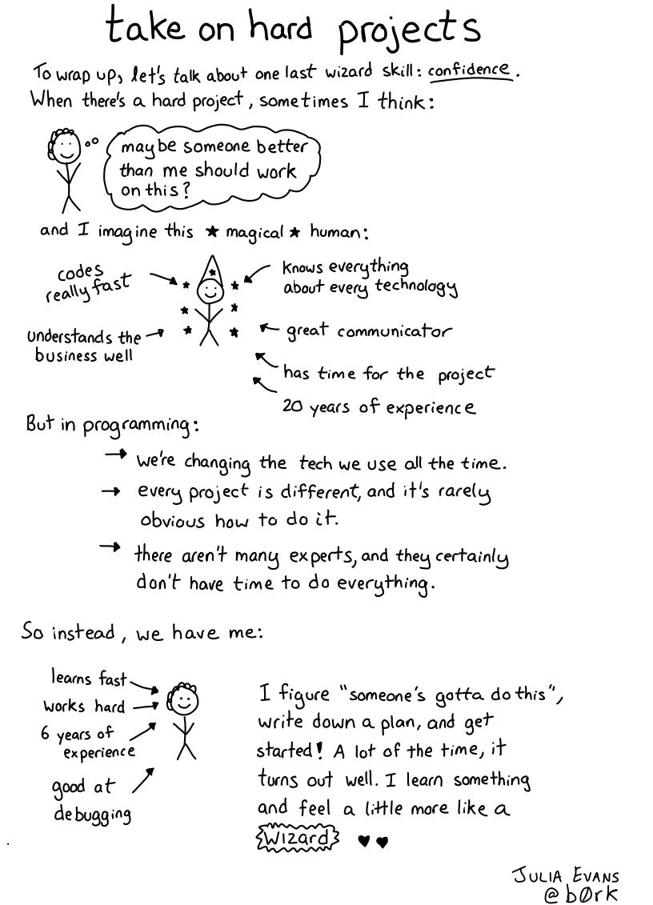

+++
title = "Tech Zines Retreat"
description = "A retreat for authors working on zines, cartoons, infographics, videos, animations, and other creative documentation of technical subject matter"
[extra]
image = "take-on-hard-projects.png"
+++

## What is it?

This is a retreat for authors working on zines, cartoons, infographics, videos, animations, and other **creative documentation of technical subject matter**. It's a week to gather in person, learn from each other, and let fun collaborations and cross-pollinations bloom.

## UPDATE: Tech Zines Retreat will NOT run in July 2023

We did not get enough reservations booked to meet our quorum to run this retreat for July 2023. Therefore, **this retreat will not run**. Guests who booked a reservation have been issued refunds. If we can get a group coordinated in the future, perhaps we can try again.

## Why should I participate?

It's going to be super fun! You'll get to work on your projects, collaborate with brilliant creative people working on similar projects, visit a lovely wilderness area, make new friends, and enjoy a restorative retreat.

----

Web comic by [Julia Evans, @b0rk](https://wizardzines.com/comics/take-on-hard-projects/), used with permission.

## What should I expect at Focus Retreat Center?

The best way to understand what we are about, whether it's what you need, and what your daily experience here will be like is to check out these pages:

1. [Our Values](/values)
1. [The Retreat Recipe](/recipe)
1. [What to Expect](/what-to-expect)

## What are the dates?

Saturday **July 8, 2023** to Saturday **July 15, 2023**. This retreat is being planned in a phased approach.

* ✅**Phase 1**: Initial Outreach and Interest Gathering
  * This phase completed in March 2023
  * We have a bunch of people in FRC slack helping to shape this retreat
* ✅**Phase 2**: Accept reservation deposits
  * We need a quorum of 6 reservations to run the retreat
  * We did **not** meet the quorem for July 2023, so the retreat is canceled.
  * Guests who paid for reservations have been refunded.
* ❌**Phase 3**: Book the retreat

{{ questions() }}
