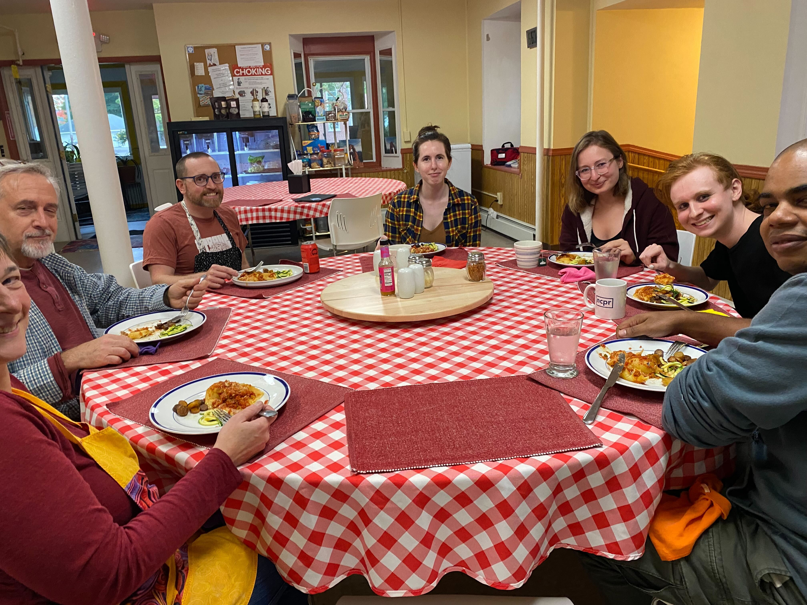
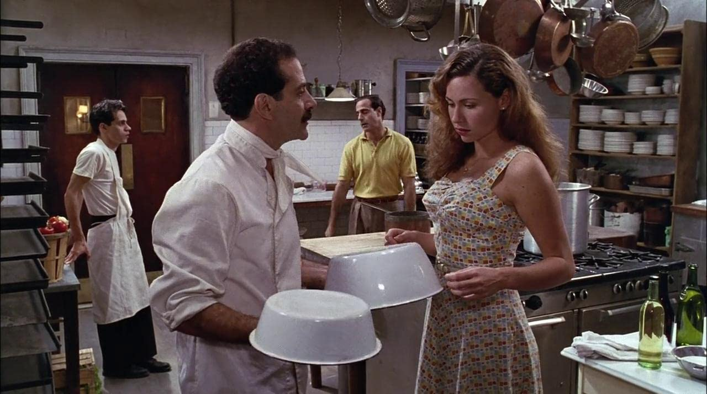

+++
title = "The Magic of Shared Meals"
slug = "/the-magic-of-shared-meals"
[extra]
author = "Pete Lyons"
+++

Shared meals are where the community building magic happens at FRC. Meals are such a great time to get to know people, share stories, and enjoy each others' company. Meals foster a sense of abundance, a sense of being cared for, a sense of belonging. There's no substitute. This is one of the key reasons Focus Retreat Center is not a 9-5 coworking setup. A live-in experience elevates the potential of friends and colleagues to have access to cultural experiences that are too often reserved for family and close friends. Every relationship enriches one's life, and deepening one doesn't diminish another, so we gather together every evening to enjoy a delicious meal prepared on site with fresh local ingredients.

The power of the meal is beautifully portrayed in one of my favorite films: [Big Night](https://www.rottentomatoes.com/m/big_night). This 1996 movie stars Stanley Tucci, Tony Shalhoub, and Minnie Driver. It's a great story and beautifully crafted film. The film centers around an elaborate meal of Italian food that is my favorite food scene ever. I love this movie more each time I watch it. It strikes close to home for me having grown up in NJ resident with Italian heritage. No spoilers but I'll also say the final scene is absolutely my favorite final scene of any movie.

