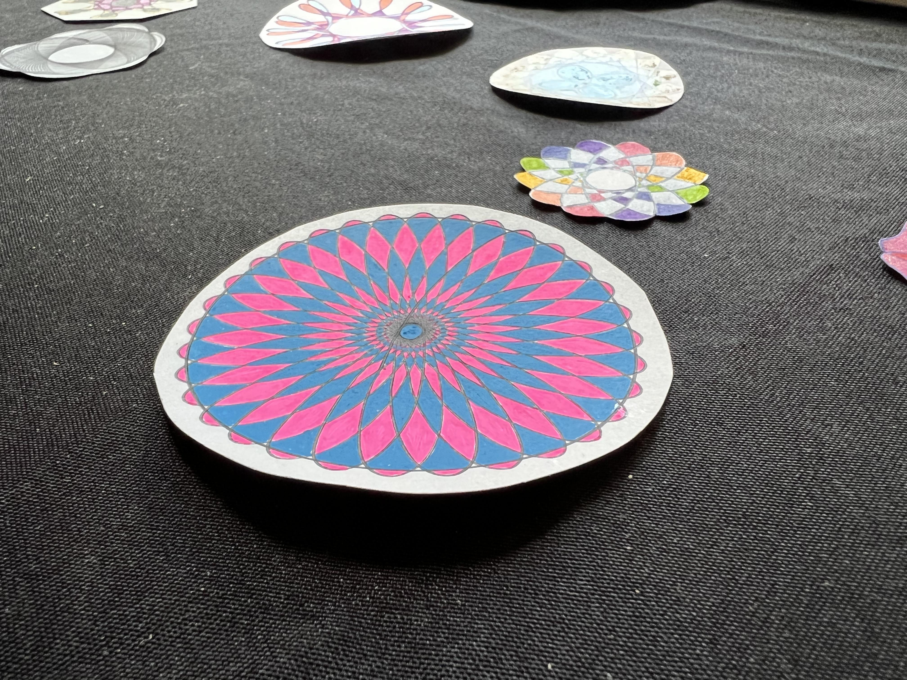

+++
title = "Residency Program"
slug = "/residency-program"
date = 2022-06-16T19:30:40Z
[extra]
author = "Pete Lyons"
+++

We are excited to announce our inaugural Residency program! The following applies to an upcoming retreat from August 1st-21st (dates negotiable if you need!).

## What is a Residency?

A Residency at Focus Retreat Center is a period of time to work on a creative coding project and prioritize creative project work. The creative work that excites and ignites you may often be relegated to the periphery of your schedule. Jammed in the nooks and crannies here and there on nights and weekends. A Residency is an opportunity to center that work, giving it full priority so it can flourish.

## Who is eligible to apply for a Residency?

If you do creative work with a computer, you're a candidate! Some ideas of the kinds of folks we're looking for:

**Creative Coders**

People working on visual art powered by programming as well as other tech-powered creative projects.

**Electronic Musicians**

People making music through code.

**Game Designers**

People designing and developing independent games.

**Open Source Maintainers**

Anyone doing development or maintenance on open source software projects.

## What are the Residency schedules?

Schedules are flexible to fit your availability. We recommend a minimum of two weeks.

## What does the Residency provide?

Residency is an award of recognition that covers your lodging and food at Focus Retreat Center so there is no cost to you.

## Can I nominate someone I know for a Residency?

Yes, absolutely please do!

## How do I apply or make a nomination?

Email us at **team@focusretreatcenter.com** or <a  href="https://us14.list-manage.com/contact-form?u=a54483dfc73731ced2ff35a04&form_id=33ffae0ec11579cdc44c4f30cb839689">Contact us here</a>. Tell us your name, a good email where we can reach you, and what you or your nominee would work on during a Residency. Share any websites or links to previous work that might help us get to know you better!

