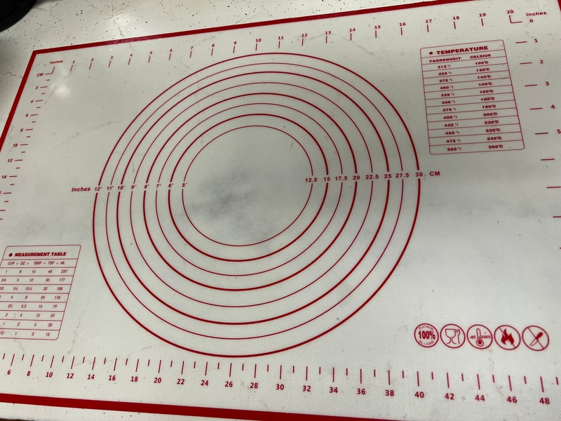

+++
title = "On Sourdough and Calipers"
slug = "/on-sourdough-and-calipers"
date = 2022-06-21T18:06:16Z
description = "Two ways to approach problems"
[extra]
author = "Stella Kay"
+++

Pete and Stella often describe themselves as *Calipers* and *Curves*.  They have very different approaches to problems and projects. But they have discovered that by combining these two points of view they often come up with unique and interesting solutions. These solutions tend to be something that neither of them would be capable of on their own.  

Pete's *Calipers* approach is all about precision.  He measures every angle and calculates clearances, edges and tries to account for the width of the saw blade.   This approach allows for excellent documentation and reproducible results.  Without calipers, we would not have bridges that can span long distances or the machines that make our lives so much easier.

Stella's *Curves* approach is all about intuition.  She feels each situation as a parabolic opportunity for learning a bit more about how the world works.  She makes freehand cuts with the jigsaw without hesitation. This approach allows for improvisation and unique solutions.  Without curves there would be no influence of nature in our creations and everything would be very sharp and flat.  

Precision and intuition are often at odds.  It seems that we are so often forced to choose between being precise and being intuitive but when it comes to sourdough bread, we can be both!

The creation of sourdough bread is an exercise in patience, science and magic.  Harvesting the wild yeast from a kitchen and teaching them how to help us bake fantastic loaves of bread is a long journey, but the rewards are unachievable through any other means.  Sure, we could quickly bake bread using store bought yeast, but the loaves would be commonplace and highly reproducible.  

By taking the time and effort to grow the sourdough starter using a magical combination of time, measurement and intuition the loaves of bread become unique and startlingly delicious.  The tang of the wild yeast and the toothiness of the crust are something that is so deeply satisfying that it becomes something more than just a piece of bread.  

Here at Focus Retreat Center we value taking the long road to a unique conclusion.  We believe that the best approach to making magic happen is to use a combination of precision and intuition, periods of intense work and periods of rest combine to create unique opportunities… in both bread and people!
