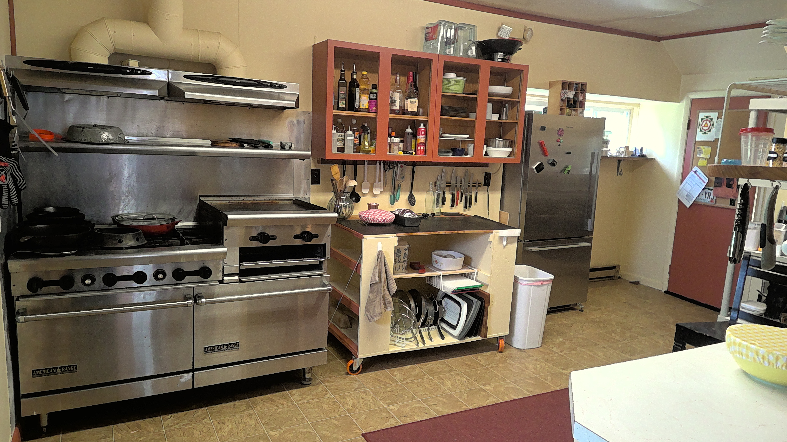

+++
title = "The Kitchen of My Dreams"
date = 2022-07-15T13:55:11Z
description = "Stella's thoughts on cooking without being a mean jerk"
[extra]
author = "Christella Kay"
image = "kitchen.jpg"
+++

I have always loved food.  When I was a kid in the 4H club, the cooking lessons were my favorite.  My first jobs were in food service, and as a teenager I loved the chaos of restaurant kitchens.  As an adult, I taught my kids to cook and to enjoy a wide variety of food and styles of eating.  I guess I am one of those people that lives to eat, rather than eats to live!

There is a huge disconnect in our culture between loving to cook and working in typical commercial kitchens though.  Our perception of commercial cooking is that you have to be ‘mean’ and that the work has to be so stressful that it makes you sick.  Most commercial kitchens are very unpleasant places.  Certainly not places that I was going to spend a majority of my time and energy.  But still, I have always dreamed of a place where I could cook every day and serve the food to eager, hungry guests.  

Part of my issue with traditional restaurants is that the cooks HAVE to cook what the guests want even if it is unhealthy or out of season.  There is often no seasonal variation or even acknowledgement of the seasons in a restaurant menu.  In most restaurants, the same food is delivered by a truck every week and is already over-processed as soon as it arrives.  The ‘recipes’ are inflexible and often use the least healthy, but cheapest, methods available.  I have always dreamed of doing it better somehow.

And now, because of the Focus Retreat Center, I am getting my chance to do it better!  I now have a fully licensed commercial kitchen that is free of meanness and stress and full of fresh seasonal food that is lovingly prepared.  I am so excited to cook for our guests.  I am looking forward to getting to know their likes and dislikes and to search for dishes that will be healthy, fresh and delicious!  

