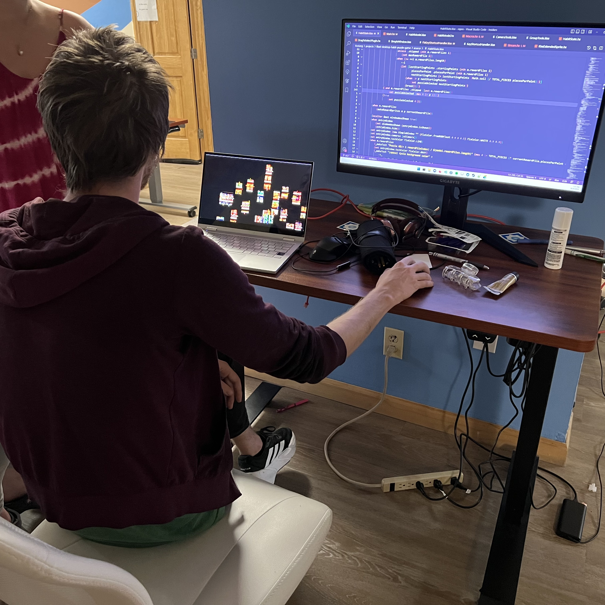
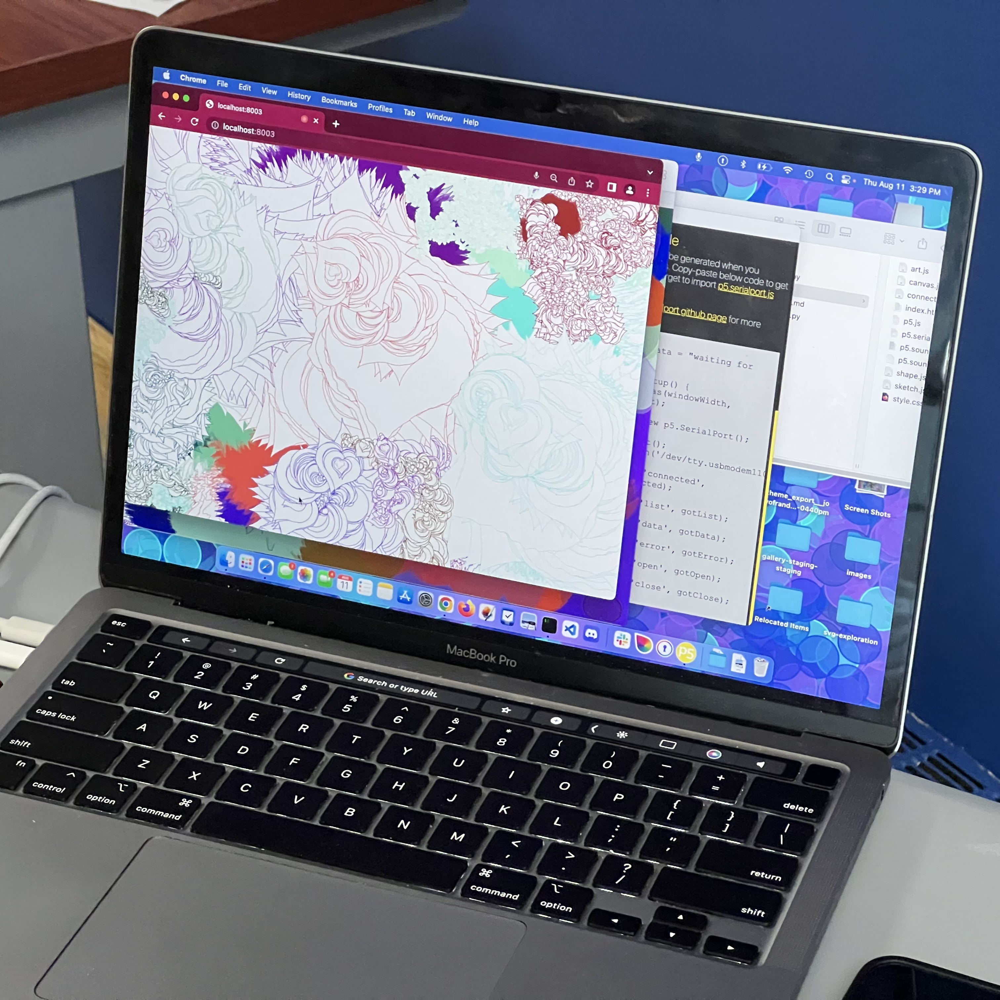
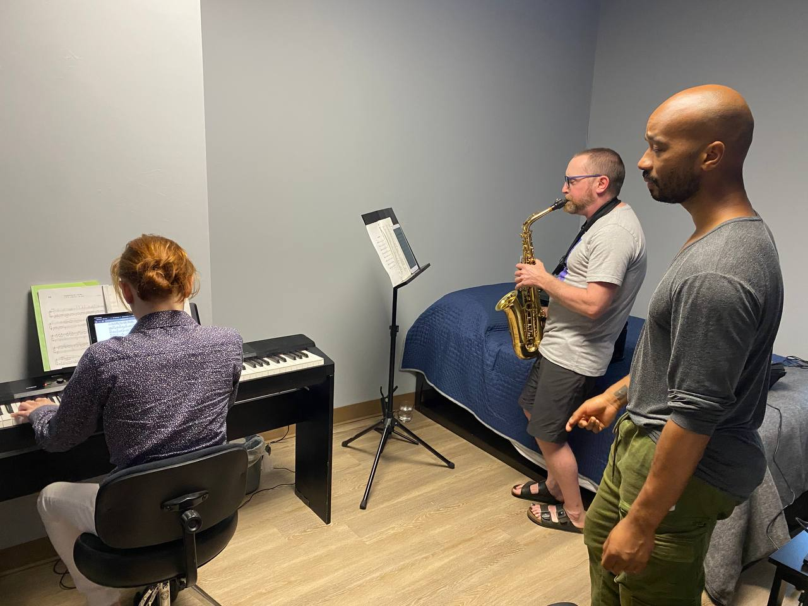
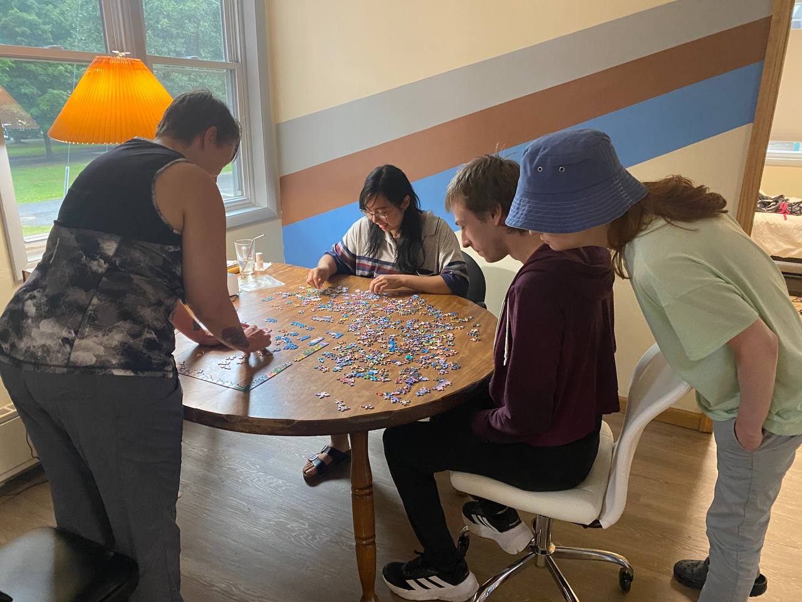
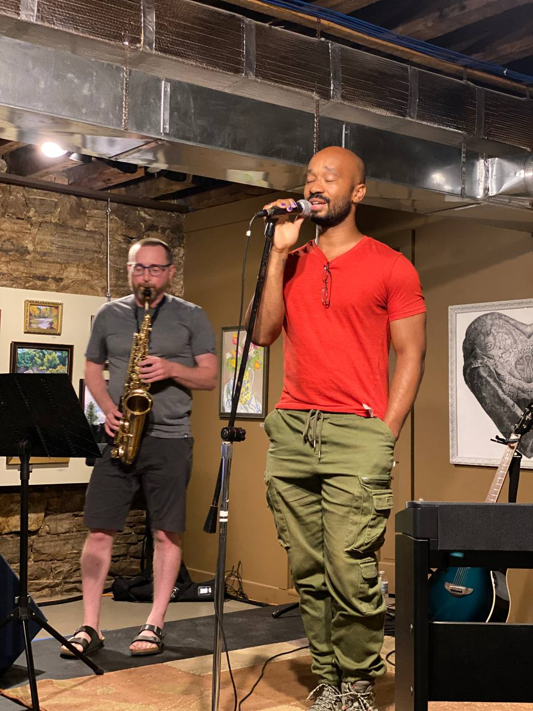
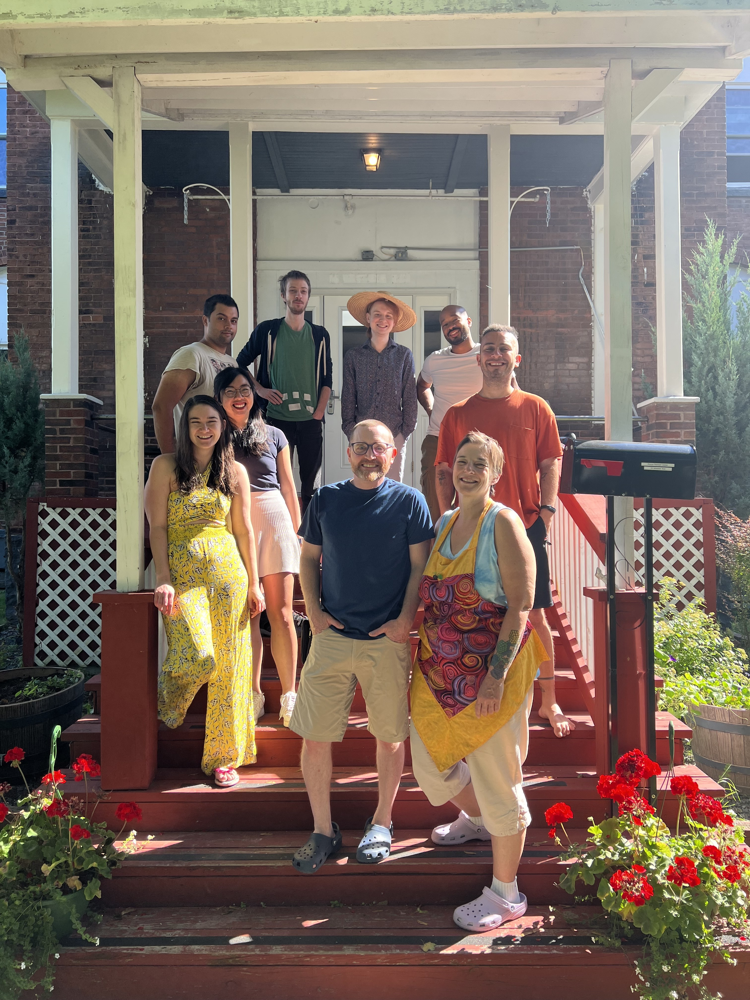

+++
title = "August Programming Retreat Highlights"
slug = "/august-programming-retreat-highlights"
date = 2022-08-27
description = "Some of our favorite moments from the August 2022 Programming Retreat"
[extra]
author = "Pete Lyons"
image = "puzzle-habits.jpg"
+++

In August we had generative artists, game developers, VR developers, data scientists, and programmers here working on their projects. This retreat was 3 weeks during the peak of the summer season.

They worked on their games and projects, collaborated with each other, and enjoyed some time to rest and reset after a stressful year.

This game is written in a custom LISP programming language and compiles through Haxe to several target languages and platforms. It’s a habit tracker that fosters healthy habits with gamification by rewarding completed tasks with a new piece of the puzzle to solve.

## Nat Demoing a Puzzle/Habit  Game

This game is written in a custom LISP programming language and compiles through Haxe to several target languages and platforms. It’s a habit tracker that fosters healthy habits with gamification by rewarding completed tasks with a new piece of the puzzle to solve.

## Rachel’s Interactive Generative Art

Rachel makes generative art that responds to inputs from the mouse, keyboard, and even microphone! Each piece is entirely unique and cannot be recreated once it’s gone.

## Hive Mind Game Play Testing

Steven is developing a game based on the concept of a hive mind that has a very unique user interface seeing through multiple sets of eyes at the same time. Here Justin is doing a play test with no special instructions.

## Jamming in the music room

Folks running through some tunes in the music room.

## AC Explains his game engine’s AI

AC is working on a sophisticated simulation game with AI models for language, social interactions, memory, and feelings.

## Relaxing with some big puzzles

## Open Mic Night

FRC was represented at the local open mic night with original music and poetry.

## Group Photo

