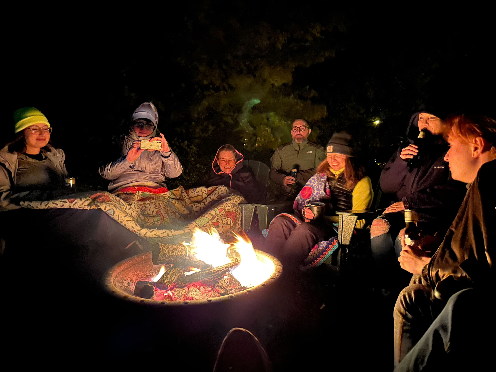

+++
title = "Startup Incubation Retreat"
slug = "/startup-incubation-retreat"
date = 2022-11-18
description = "Could your startup use a boost out of the gate by working together on a retreat?"
[extra]
author = "Pete Lyons"
image = "fire.jpg"
+++

In our last post we talked about the large layoffs we've seen this year from big tech companies and how that might catalyse personal change. In this post we want to talk about how this effects the scene for brand new small startups. There could be as many as 100,000 tech workers who unexpectedly and suddenly lost their jobs. We wish each of you success in responding to that, whether it's finding another job, taking some time off, changing course to do something else, or perhaps gathering a few friends and starting a new company.

I can imagine scenarios where a small group of folks have experience working closely together at one a big tech company and all got laid off around the same time. Here's a great opportunity to "acquihire" yourselves as a fully-formed team and dive into that idea that you chatted about but could never get started at the big company. It's hard to overstate how valuable it is to have an established team that is gelled and works well together. It's gold.

Your group may already be primed with a shared understanding of a problem that needs solving. Maybe now's the time to brainstorm what a solution could look like. Maybe you relied on a great but unpolished internal tool that really should be a commercial offering. This has played out many times such as kubernetes (origins in "borg" internal to Google), prometheus (origins in "borgmon" at Google), kafka (origins at LinkedIn before Confluence spun off as a separate company), and many others.

It seems a certainty that the huge exodus from twitter to mastodon is enough to generate a handful of companies founded by ex-twitter staff bringing their expertise to the fediverse, much like there's a host of companies that provide value-add services on top of twitter.

Hiring in tech, especially engineers but really most roles, has been a huge struggle and pain point throughout recent memory. If you have a ready-made team that could be the initial employees for a startup, that is a huge opportunity.

Here's a salient twitter thread relevant to the Twitter layoffs.

<blockquote class="twitter-tweet" data-dnt="true">
9 uncomfortable truths about engineering and tech right now.   How Twitter might play out, the ramifications, and what Elon’s calculus might be.  Disclaimer: Don’t shoot the messenger. I’m relaying observations through a lens of engineering for over a decade &amp; managing engineers.
&mdash; Louie Bacaj (@LBacaj) <a href="https://twitter.com/LBacaj/status/1593705261939802112?ref_src=twsrc%5Etfw">November 18, 2022</a></blockquote> 

We here at Focus Retreat Center want to see if there's interest in doing an immersive incubation retreat for new startups in 2023. If you have thoughts about that, please take a moment and fill out this brief survey so we can best align our offerings next year to fit your needs.

{{ survey2023() }}
