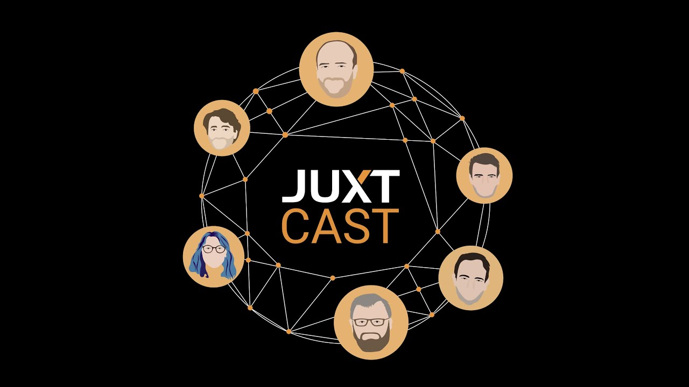

+++
title = "Pete Interviewed on the JUXT Podcast"
slug = "/pete-interviewed-on-the-juxt-podcast"
date = 2022-12-04
description = "A podcast interview where Pete talks about FRC and the kinds of work people do while on retreat"
[extra]
author = "Pete Lyons"
image = "juxtcast.jpg"
+++

In September, Pete attended the [Strange Loop](https://thestrangeloop.com/) Tech Conference held in St. Louis. One of the sponsoring tech companies, [JUXT](https://www.juxt.pro/) had a booth and conducted a series of short interviews/chats with attendees for their podcast, the JUXT Cast. JUXT is a consultancy bringing great people and innovative technologies together. They do a lot of clojure, have a super cool bitemporal database product called XTBD, and have been longtime participants and sponsors with Strange Loop.

In this short 13-minute chat, Pete takes Renzo through the motivation and backstory for Focus Retreat Center, what types of groups we had in our first season, and what a typical experience at FRC is like.

<a href="https://pnc.st/s/juxt-cast/f0fac951/strange-loop-edition-a-chat-with-pete-lyons">https://pnc.st/s/juxt-cast/f0fac951/strange-loop-edition-a-chat-with-pete-lyons</a>

<iframe frameborder="0" height="61" src="https://pinecast.com/player/f0fac951-9e6d-46aa-b752-206fc5434c66?theme=cardstock&amp;dark=false&amp;shortlink=true" title="Episode player" width="100%" style="border: 0px;"></iframe>
