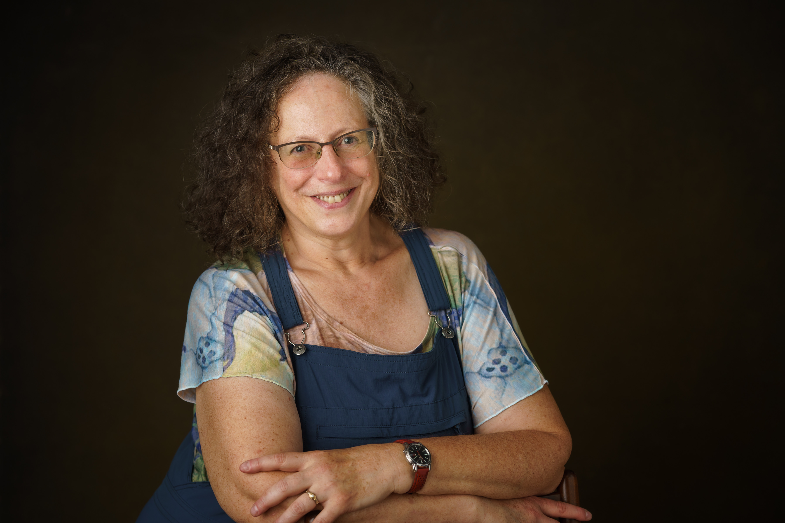
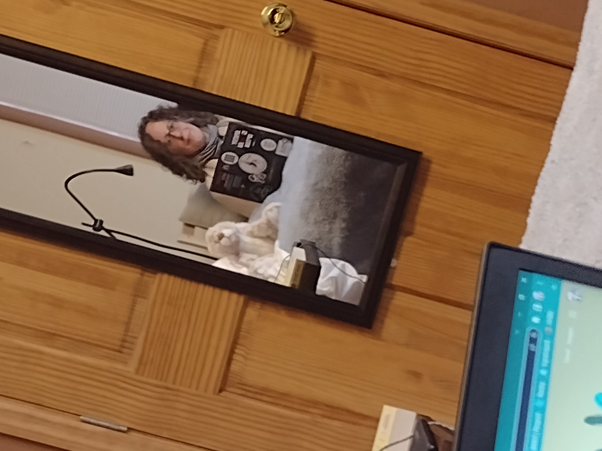

+++
title = "Five Books: Rhonda Rosenheck's Writing Residency"
slug = "/five-books-rhonda-rosenhecks-writing-residency"
date = 2023-01-09
[extra]
author = "Pete Lyons & Rhonda Rosenheck"
+++
Rhonda Rosenheck is a poet, humorist and bible-translator from New York’s Capital Region. She came to the FRC to start off 2023 with a week of Focus. 

## What project are you working on?

The work-in-progress I brought with me to FRC is a fresh English translation of the book of Genesis. The work is detailed and sometimes tedious; I need large blocks of time to stay with it through frustration. 

## What's your hope for the project long term?

With the steep acceleration of damage humanity is causing each other and the environment, I wondered if re-reading the Bible without 3000+ year-old cultural assumptions could provide guidance for new ways to relate. I began the translation as an experiment I assumed would fail, and yet, about halfway through Genesis, my work continues to result in valuable, sometimes stunningly profound meanings. 

Basically, I unpack each word without a plan for how it will progress or what narrative it will form. I refer only to linguistic scholarship – not interpretive or archeological – and distill every name down to its root meaning(s). In the publication, I will include an outline of my hermeneutics so that scholarly, political and spiritual leaders can refer to my method as they shred and discredit my work. After all, who am I to upturn everything we’ve assumed for so long? 

While I don’t see this as a feminist undertaking, I think it does matter that I’m not a member of the empowered gender in the hierarchies we assume the Bible endorsed. I will only be the second woman in history to have her translation of the Five Books of Moses published – the first was in the 1850s. 

I’m 61 years old, so translating all Five Books of Moses is probably the work of the rest of my life. That’s daunting for me, as a person who prefers close-ended projects. But this feels like it could make a contribution to the human enterprise, so I’ll get it done. 

## What makes it hard to work at home?

Bills. Dust bunnies. The garden and the invasive vines I battle. My beloved in the other room, and what I might want to say to him. In that environment, I can jot down a poem from a flash of inspiration, but I cannot focus uninterrupted for hours. 

## What's your ideal cozy/productive setup look like? 

There must be coffee, tea or fizzy water – often more than one. Beverages are the main reason I don’t write at the library. Desk and chair are usually my least favorite way to sit, but with this project, they facilitate the shifting around screens and tabs and programs I need to research before deciding each word’s translation. Even so, I must sometimes lounge, laptop perched above the throw blanket on my knees, and a snack on the side table. I work well in quiet and with the hum of other people working on their own stuff around me. Either way, I love to commune with others working on utterly different creative work than mine. That’s why shared dinners and clean-up at FRC have been a huge pleasure and inspiration for me. 

