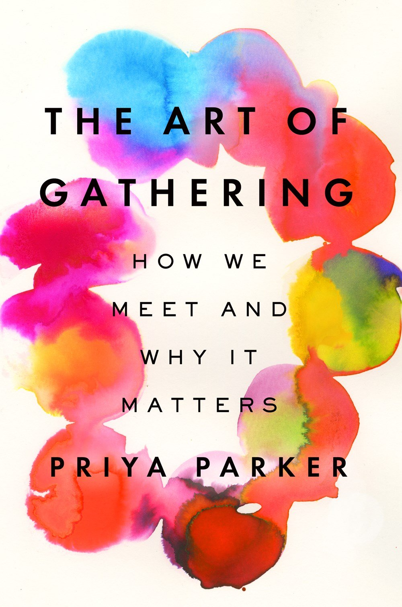

+++
title = "The Art of Gathering: Introduction"
description = "Series of posts on key takeaways from the book The Art of Gathering"
slug = "/the-art-of-gathering-introduction"
date = 2023-02-01
[extra]
author = "Christella Kay"
image = "taog-book-cover.jpg"
+++

# Impact of this book

> Having a purpose simply means knowing why you’re gathering and doing your participants the honor of being convened for a reason. And once you have that purpose in mind, you will suddenly find it easier to make all the decisions that a gathering requires. &mdash;Priya Parker

I read a book last fall that has had a significant impact on my identity as a host at the Focus Retreat Center. The book is called “The Art of Gathering: How We Meet and Why it Matters” by Priya Parker. The author’s perspective and thoughts on what it means to host meaningful, intentional gatherings has followed me on my winter travels - causing me to refine in my mind my role at FRC.

I spent my time during our first retreats last summer acting and reacting with the vague hope of somewhat resembling a host. I bumbled along answering direct questions, making obvious adjustments, and scrambling around the kitchen trying to get everyone fed. It happened. The retreats were largely successful, and I learned a lot about the needs of typical guests. As if there was any such thing as a ‘Typical Guest’, Ha! 😄

The Art of Gathering came into my life at just the right moment. I had just collected a lot of kitchen data and had learned the strengths and weaknesses of my kitchen & dining room setup. Plans to improve systems and efficiency were starting to become clearer. I was ready to take my role to the next level. Priya Parker's book gave me the framework to go from acting like a host to really becoming one!

I will be writing a series of blog posts on the subjects covered in this book, there are just too many revelations to cover in one essay. The topics I will cover include:

* how not to be a ‘Chill Host’
* creating a ‘Temporary Alternative World’
* why endings matter so much
* how I would like for these lessons to impact what we do at FRC

I am genuinely excited to host next summer's events with generous authority!

> Generous Authority is not a pose. It’s not the appearance of power. It is using power to achieve outcomes that are generous, that are for others. The authority is justified by the generosity. &mdash;Priya Parker

## More in this Series

This post is first in a series on The Art of Gathering.

* [Don't Be a Chill Host](/blog/dont-be-a-chill-host/)
* [Create a Temporary Alternative World](/blog/create-a-temporary-alternative-world/)
* [Good Endings](/blog/good-endings/)
* [How Lessons from TAoG Will Impact FRC](/blog/gathering-at-frc/)
