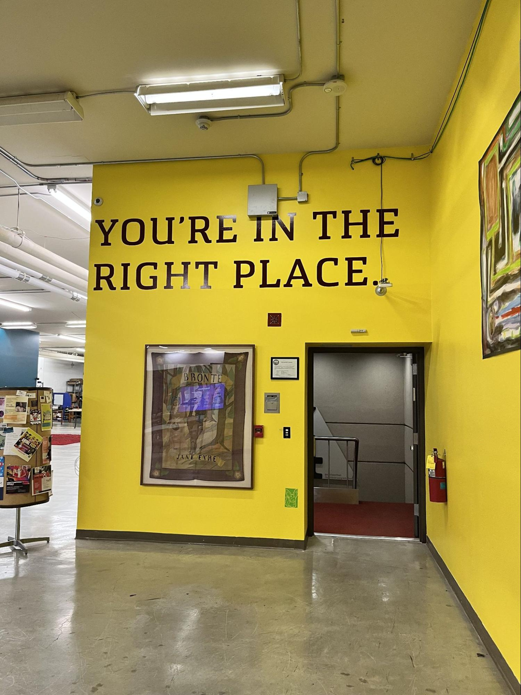

+++
title = "Create a Temporary Alternative World"
slug = "/create-a-temporary-alternative-world"
date = 2023-02-16
[extra]
author = "Christella Kay"
+++

> A gathering's blandness is a symptom of a disease. We must treat the disease. And what is the disease? That the gathering makes no effort to do what the best gatherings do: transport us to a temporary alternative world. ―Priya Parker

Most people that know me would likely use the word 'anti-authoritian' when describing my general attitude. It is safe to say, I am not a rules type person. I am Gen-X. We don't really do rules. So, imagine my surprise when I found myself agreeing with Priya Parker when she suggested that 'Pop-Up Rules' are a key to a great gathering! In her book “The Art of Gathering: How We Meet and Why it Matters”, Parker sets up a dynamic comparison of pop-up rules vs etiquette.

> If the standards of etiquette are fixed, imperious, and exclusionary, pop-up rules have the power to flip these traits on their head, creating the possibility of more experimental, humble, and democratic - and satisfying! - gatherings. If etiquette is about sustaining unchanging norms, pop-up rules are about trying stuff out. ―Priya Parker

The reason we need pop-up rules to have satisfying gatherings lies in the notion of creating a temporary alternative world that will hold the gathering. Designing a container out of rules creates a space that is especially compelling, and comforting, to guests attending that gathering. I began to understand that by creating rules for my gatherings I was rebelling against etiquette itself! What the rules provide is a direct replacement to the ‘passive-aggressive, exclusionary, glacially conservative commandments of etiquette with something more experimental and democratic’. By dictating the details of expected conduct up front and plainly, leaving nothing to the imagination or social cues, allows all participants to understand what is happening and why. What a revelation!

“Etiquette allows people to gather because they are the same. Pop-up rules allow people to gather because they are different - yet open to having the same experience.”, says Parker. One of my primary goals at Focus Retreat Center is to be welcoming and accommodating to many different types of people. These differences might be cultural, or neurological, or just generalized strangeness. I sincerely want even the most awkward of humans to find a way to be nurtured at FRC. By being clear and explicit about the social expectations and rules of the gathering (and then enforcing those rules by exercising generous authority!) a host can provide a level playing field for all their guests to interact on. This act of leveling will then allow interactions between guests that are meaningful, profound - and satisfying!

It is my intention to be as clear as possible about the house rules and to help people understand that the rules that are being presented are not meant to restrict the gathering, but rather to contain it. By enforcing the rules I will create an environment of trust that helps guests feel safe. These rules allow us to collectively build a temporary alternative world where we can share information without the clutter of old-fashioned etiquette and confusing social cues.

> That is the point and the magic. In a world of infinite choices, choosing one thing is the revolutionary act. Imposing that restriction is actually liberating.” ―Priya Parker

This post belongs to a [series of posts about The Art of Gathering](/blog/the-art-of-gathering-introduction/#more-in-this-series).
