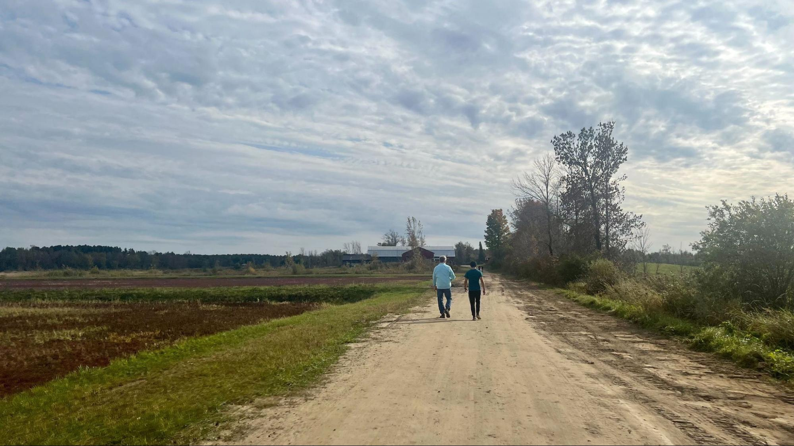

+++
title = "Good Endings"
slug = "/good-endings"
date = 2023-02-21
[extra]
author = "Christella Kay"
image = "path.jpg"
+++

> The first step to closing a gathering well is less practical than it is spiritual or metaphysical: Your must, before anything, accept that there is an end. You must accept your gathering’s mortality. &mdash;Priya Parker

Endings are hard. Ending things that are wonderful and satisfying is **really hard**. But all things end and according to Priya Parker in her book “The Art of Gathering: How We Meet and Why it Matters”, accepting the impermanence of our gatherings is part of the art. It is the job of a host to design an ending that allows guests to both look inward &mdash; at how the gathering affected them, and to turn outward to see how the gathering will propel them forward.

> …gatherings will benefit from a pause to reflect on what happened here. A gathering is a moment of time that has the potential to alter many other moments of time. And for it to have the best chance of doing so, engaging in some meaning-making at the end is crucial. &mdash;Priya Parker

Parker suggests approaching your designed ending as a two-phase event:

The first part of the ending should be about looking inward. This involves doing some ‘meaning-making’ and helping guests connect with each other one last time. The host should lead guests, gently but firmly, toward some collective exercise of taking stock of the experience and to observe themselves as a cohesive group or tribe.

The second part of the ending should be about turning outward toward separation and reentry into ‘real’ life. It is important to address the concerns of the group around the issues of transitioning back into the world. It is the job of the host to guide guests in thinking about what they would like to take with them as they go back into their lives. 

At FRC we value the endings as much as the beginnings! Even though endings are hard, we commit to designing the end of each retreat to provide our guests with a moment to reflect on how the retreat process affected them personally and to form a plan for how to take that new energy out into the world with them as they exit our temporary alternative world and step back into their original context.

> A good and meaningful closing doesn’t conform to any particular rules or form. It’s something you have to build yourself, in keeping with the spirit of your gathering, in proportion to how big a deal you want to make of it. &mdash;Priya Parker

This post belongs to a [series of posts about The Art of Gathering](/blog/the-art-of-gathering-introduction/#more-in-this-series).
