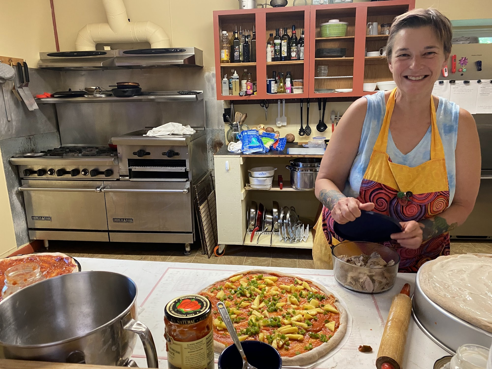

+++
title = "How Lessons from TAoG Will Impact FRC"
slug = "/gathering-at-frc"
date = 2023-02-24
description = "How FRC will apply what we learned from The Art of Gathering on our retreats"
[extra]
author = "Christella Kay"
image = "pizza.jpg"
+++

> Gatherings crackle and flourish when real thought goes into them, when (often invisible) structure is baked into them, and when a host has the curiosity, willingness and generosity of spirit to try. &mdash;Priya Parker

As I have traveled around the USA this winter, I have had a lot of opportunities to observe and participate in all types of gatherings. As a traveler, I was mostly playing the role of a guest, so this was a great time to observe many of the lessons from Priya Parker's book “The Art of Gathering: How We Meet and Why it Matters” from that guest perspective. I was able to see, and feel, how different a gathering with clearly defined purpose, a not-chill host, and a sense of being in a temporary alternative world is from a gathering that just …sort of happens. Let me say, the difference is remarkable!

It is my sincere intention to take these lessons back to my job at FRC. In my role as a host, I hope to be able to stay keenly aware of how it felt to be a guest. I am going to benevolently rule over my gatherings with a generous authority, enforcing pop-up rules as I go, all while creating a container to hold our temporary alternative world!

When answering a question about how a group should choose ‘a good, purposeful location’ for their gathering, Parker answers like this: 

> You should, for starters, seek a setting that embodies the reason for your convening. When a place embodies an idea, it brings a person’s body and whole being to the experience, not only their minds.

 It is my intention to make Focus Retreat Center the *embodiment* of our gatherings, bringing our guests into a state of wholeness and empowered creativity. Parker goes on to state that another essential element in choosing a perfect location for a gathering is *displacement*, also known as a *change of scenery*.

> Displacement is simply about breaking people out of their habits. It is about waking people up from the slumber of their own routines…But it is possible to achieve a great deal of displacement through the choice of a space. &mdash;Priya Parker

When I consider these ideas of embodiment and displacement as reasons to host gatherings here at FRC, it seems so clear to me that here exists a unique opportunity for personal development with the possibility of getting to host actual life-changing events!

Please consider joining us for one of these events! We are open to many types of gatherings from casual co-living arrangements to very formal and structured workshops. Whether you would like to host an event, or be a guest at someone else's event, or take up a longer term residency I would love to talk to you. Please email me at **team@focusretreatcenter.com** or join our email list below.

This post belongs to a [series of posts about The Art of Gathering](/blog/the-art-of-gathering-introduction/#more-in-this-series).

{{ mailchimp() }}
