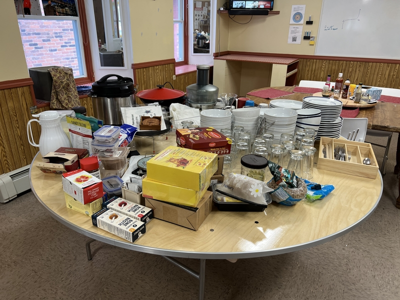
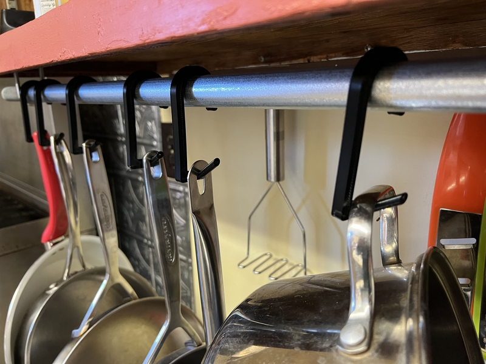
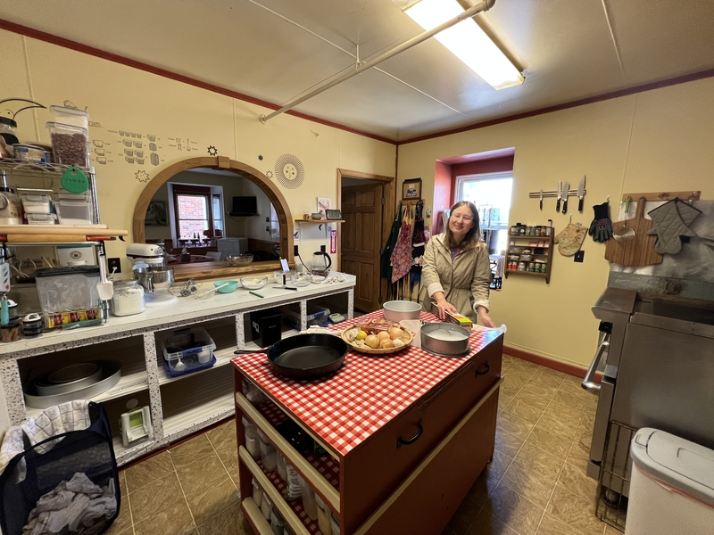
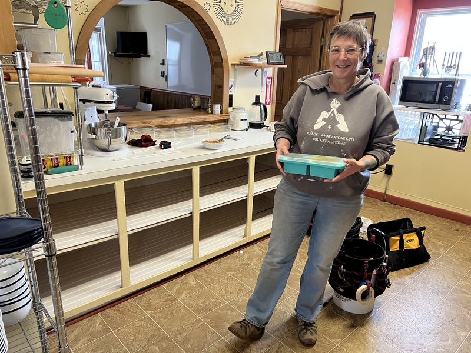

+++
title = "Kitchen 2.0"
slug = "/kitchen-20"
date = 2023-06-26
description = "Key design elements of the new and improved kitchen layout"
[extra]
author = "Christella Kay"
image = "shelves.jpg"
+++

Pete and I took a long road trip over the winter. We stayed with friends and family, or in short term rentals all over the country. It was great to take a step back from FRC and get some of that perspective that comes naturally  with distance from a big project.

While we traveled I had the opportunity to visit several kitchens. I tried to be mindful when visiting a new kitchen, to ask myself questions and to observe how the flow of the kitchen happened (or didn’t happen). These kitchen’s varied greatly in their functions and aesthetic but each one of them taught me something about kitchen design.

When we got back to FRC in the spring, I found myself inspired to reset my workspace. I emptied everything out of my kitchen and then slowly put objects into place using the lessons I had learned on the road. The result is a much better work flow in the kitchen!

Better flow makes work less stressful and reduces fatigue.  It also makes cooking more fun!

Here is a short list of the changes that were made in v2.

## Pan and lid storage

 * All pans and lids must be visible for quick analysis of available equipment
 * No Stacking Allowed!
 * Pots and pans cannot be stored overhead or near the floor as they are just too heavy

## Our floating kitchen island

Our island is on casters so it can "float" around the kitchen.

 * This allows the space to be configured many ways
 * We have Better access to side storage bins
 * Increases number of workstations available in the kitchen

## Removal of the cupboard doors

 * (this was actually in V1, but is an important part of the design)
 * There is no need for a mental map of kitchen storage when all the shelves are visible
 * Having open concept storage allows for Quick Inventory when preparing to shop
 * Mindfully **not** hiding food/brands provides guests the opportunity to observe the ingredients being used to make their meals
 * This style of storage forces frequent purging of pantry and provides incentives to keep supplies orderly

## Boxes instead of more traditional drawers

 * This system is more flexible and can be  arranged to fit current/different tasks
 * No mental map of storage needed because you can see into the container without opening anything
 * It is quick and easy to relocate an item to a different container
 * This method Invites user to inspect the entire contents of the box so nothing is lost in the back

