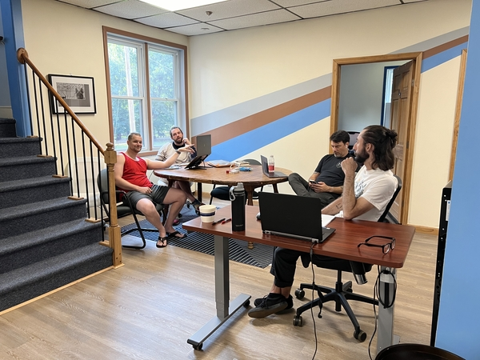

+++
title =  "Coworking at FRC"
description = "Work without distractions"
image = "/images/map2.png"
+++

Coworking day passes are available. We've got everything you need to be productive and none of the things from your home office that make it a challenge!

# Yes

* Sit/Stand ergonomic desks
  * Switch between sitting and standing regularly for best results
* Ergonomic office chairs
  * adjustable for a tailor fit
* Fast reliable WiFi: 940 Mbps down, 40 Mbps up
  * Works great everywhere with WiFi6 access points in the ceiling
  * Wired ethernet also available if you prefer
* Rooms to take video calls
* Coffee, tea, and snacks

# No

* Cat walking across your keyboard
* Children knocking on your door
* Spouse asking if you put gas in the car
* Dog glaring at you at meal time
* Laundry hamper in your zoom background

Opening hours are 9AM to 5PM most days including weekends. Call or TXT to confirm: 518-310-8879.

<a class="brand-button" href="https://book.stripe.com/4gweVOdpS7wN0rm5kr">Buy Day Pass for $12</a>

