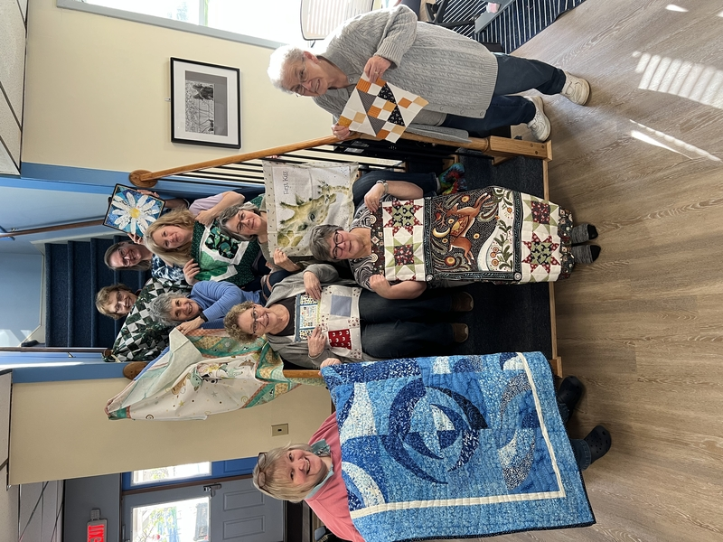
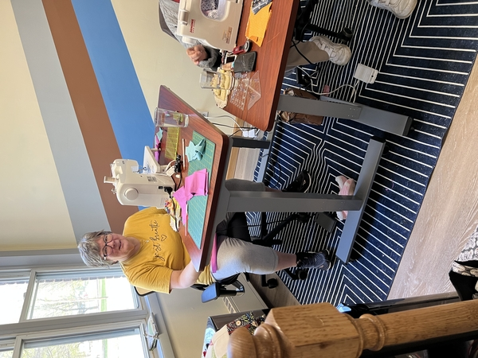
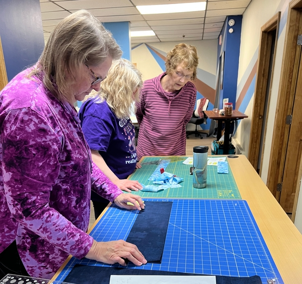
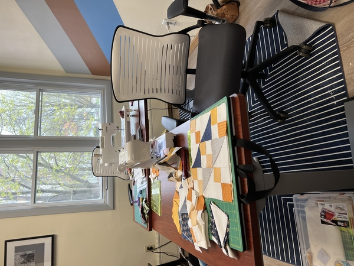
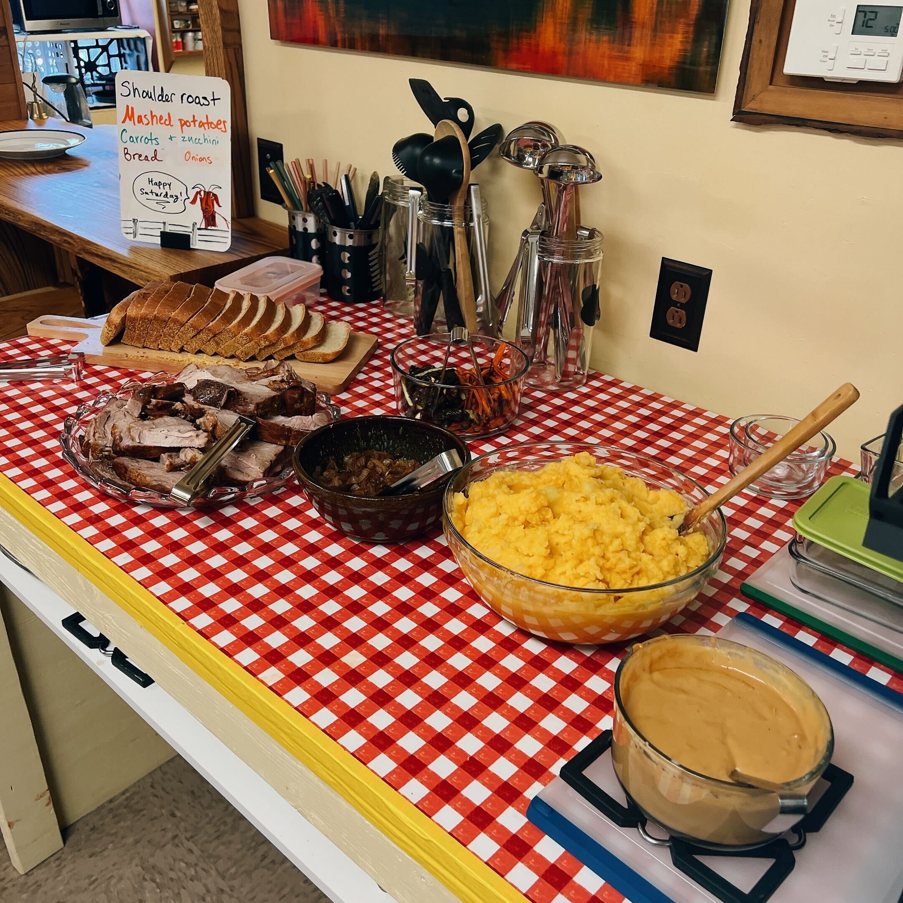

+++
title =  "Quilting Retreats at FRC"
description = "Fun times quilting together, laughing, and learning."
+++

You should organize a quilting retreat! FRC is an ideal venue for small group quilting retreats. It's a great time to get lots of work done on your projects, relax with your friends, and inspire each other with your creativity and skills.

# Guest Amenities

Each person in your group will be furnished with:

* A private, single-occupancy bedroom with a full size bed
  * No bunk beds here!
* An ergonomic desk with adjustable height
* An ergonomic adjustable office chair

# Facilities

We've got everything you need for quilting and sewing!

* Capacity for up to 14 total guests
* 6 shared guest bathrooms with plenty of hot water for showers
* Plenty of power outlets
* Massive adjustable-height cutting desk you can set nice and high
* Great spots for dedicated cutting stations and ironing stations
* 2 common rooms where workstations can be arranged however works best for your group
* Fast, reliable WiFi for streaming music or reviewing those tutorial videos
* There's a Jo-Ann Fabric in town for any surprise supply needs plus a couple of local quilting specialty shops in the area

# Dining

Full meal service features fresh seasonal food sourced locally and prepared by our on-staff chef Stella in our commercial kitchen. Your group will be pampered with fabulous food.

# Group Organizer Benefits

* Complimentary ticket
* Sales commission on group ticket sales

# Get in touch and we'll help you plan

Email us at team@focusretreatcenter.com or call 518-310-8879.

