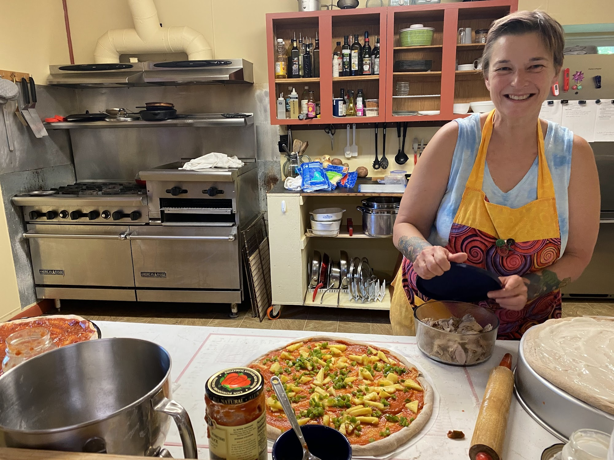
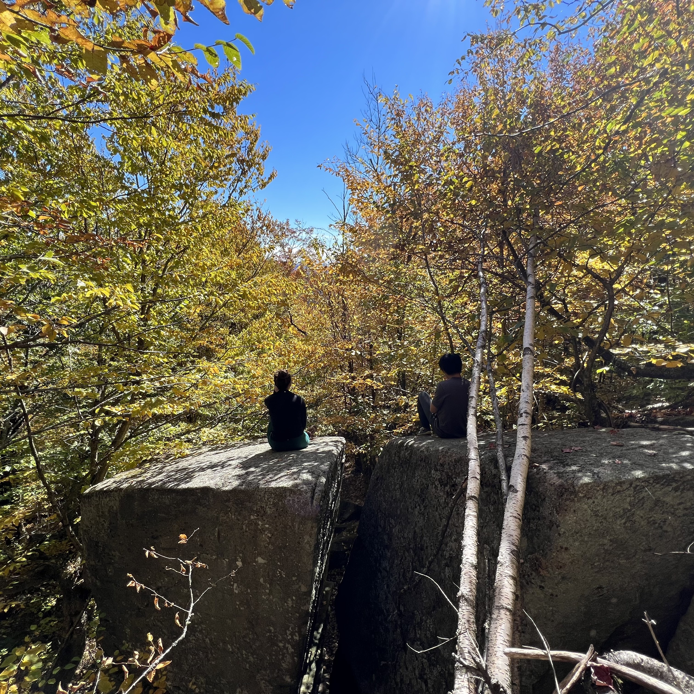
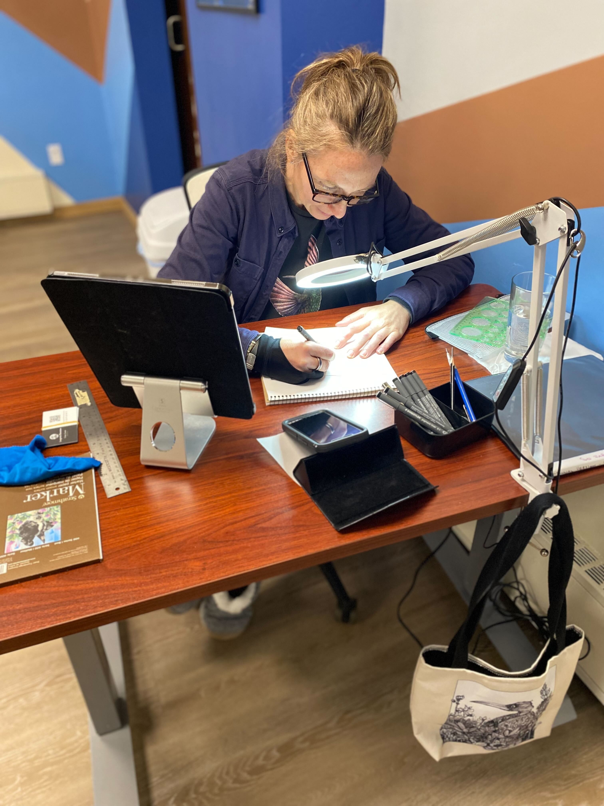
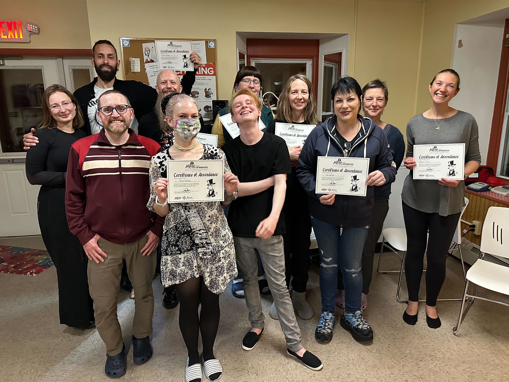

+++
title = "The Retreat Recipe"
+++

The following three ingredients are the core essence of what we combine together to produce the noursishing experience of a Focus Retreat.

## 1. Personal Wellness

Personal wellness is a foundational value for both happiness and creativity. While we appreciate the great works of music, art, and literature, we reject the self-destructive lifestyle that is far too common among brilliantly creative people. At FRC, self-care and personal wellness take first priority.

* Eat nutritious food that has been prepared with care from fresh ingredients
* Catch up on sleep and learn to recognize your personal sleep needs
* Unplug and slow down in a sleepy rural town setting
* De-stress by hiking through forests and mountains
* Tune your body with yoga and exercise
* Break unhealthy relationship patterns by taking time away from home

## 2. Deep Creative Work

We think the most valuable thing creative people can do is put their best energy into their work in a focused way. Creative work takes second priority at FRC. Your project is prioritized for many hours a day and many days in a row. Your internal motivations can shine through and provide direction to your work.

## 3. Inspiring Peers

A group of like-minded peers with similar interests creates a fun atmosphere and fosters collaboration, inspiration, and friendship.You'll meet wonderful people and get to know them at the dinner table, on the hiking trail, and around the fire pit. Sharing meals and adventures builds a sense of belonging and community. We hope to form many long-lasting friendships at FRC.

The energy of a group working together is palpable and powerful. Your retreat cohort will help hold you accountable for the systems and habits you choose as you work. You'll find connections to each others' projects and ways to collaborate and help each other.

## 4. Fun!

Hey, we're modeled kind of like a kid's summer camp after all! We work hard, and play hard too.

{{ youtube(id="heeVSrrWo9c" orientation="portrait") }}

## Considering a Retreat?

{{ mailchimp() }}

## Next: What to Expect

Curious about the daily experience at FRC? Read about [what to expect on retreat](/what-to-expect).
