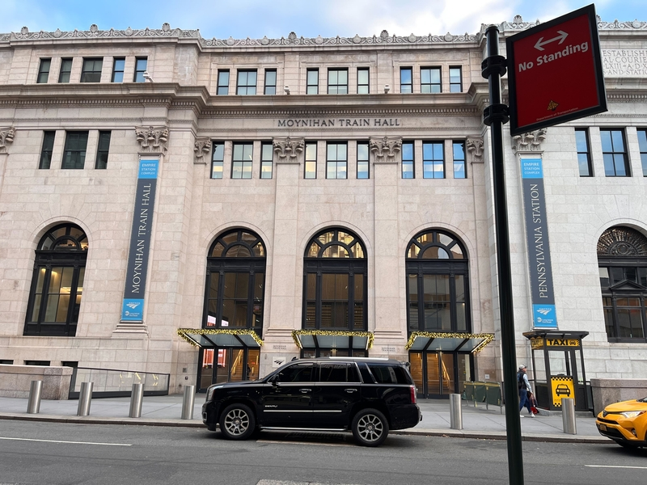
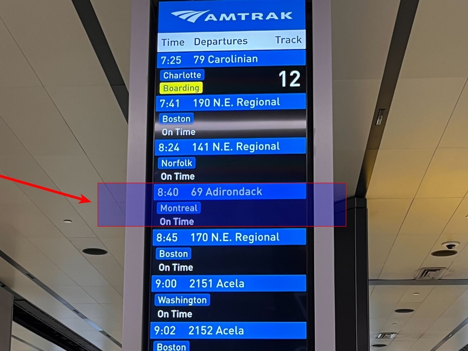

+++
title =  "Getting to Malone, NY"
description = "Detailed travel logistics and information for getting to FRC by car, bus, train, or plane"
+++
Our address is:

16 Wheeler Ave
 
Malone, NY 12953-1603

<a href="https://goo.gl/maps/4GvniRYNAE1gHtSg9">Directions via Google Maps</a>

### Car

Malone, NY is reachable by car in a day or less from NYC, Philadelphia, Boston, Montréal, or Toronto. If you plan to drive a private car just let us know. We have private off-street parking available. If you are willing to offer carpool rides to other guests, that's fantastic. Let us know and we can help coordinate.

### Rental Car

A 1-way rental car that you pick up at the airport and return in Plattsburgh is one of the fastest and most convenient options to get to FRC from major airports in the region. If you can coordinate with even 1 other guest to split the cost of a rental car and gas this can be the most affordable option. With a groups of 3 or 4 people the per-person cost gets even lower. FRC can shuttle groups from the rental car return at Plattsburgh airport to FRC.

### Bus

**Greyhound NYC to Plattsburgh**: runs from either Port Authority or Midtown (31st & 8th Ave) to Plattsburgh, NY a few times a day. The trip takes approximately 6 hours and costs around $75 one way. You arrive at Mountain Mart at 7155 Rte 9, 12901 Plattsburgh, NY. FRC can shuttle groups from Plattsburgh to FRC.

Coming from other locations look for bus routes to either Plattsburgh NY, Saranac Lake, NY, or Lake Placid, NY.

### Train

**Amtrak NYC to Plattsburgh, NY:** Amtrak's Adirondack Line runs from NYC (Moynihan Train Hall at Penn Station) to Plattsburgh, NY daily. We can shuttle groups from Plattsburgh to FRC. This is the best route by train. Coming from NJ, take Amtrak to Moynihan Train Hall at Penn Station then transfer to the Adirondack Line. If you cannot find a workable itinerary, Burlington, VT is the next best choice.

**Amtrak NYC to Burlington, VT:** Amtrak's [Ethan Allen Express Service](https://www.amtrak.com/ethan-allen-express-train) runs from NYC to Burlington, VT. We can shuttle groups from Burlington to FRC.

**Amtrak NYC to Albany, NY:** will get you about half way to FRC but it's still 3.5 hours to drive from there. You can also take a bus from Albany to Plattsburgh which is much closer to FRC.

### Plane

* **Adirondack Regional Airport** (SLK) in Saranac Lake, NY is about 45 minutes south of Malone and the nearest airport. There are daily flights on Cape Air from JFK airport in New York City. Jet Blue also has some flights.
* **Burlington, VT** (BTV) is just over 2 hours drive from Malone and has some flights landing there.
* **Montréal-Trudeau International Airport** (YUL) is about 1.5 hours drive from Malone, and connects to many international airports directly with good prices and times. However, you will need to plan for crossing the border between Canada and the US. Be sure to bring your passport and allow extra time for customs.
* **Albany International Airport** (ALB) in NY is the nearest large international airport with many flights, but it is still a 3.5 hour drive to Malone.
  * From the Albany airport if you can take rideshare/taxi to Albany Greyhound bus station, you can take the bus on to Plattsburgh, NY and we can coordinate a ride from Plattsburgh to Malone for you.
